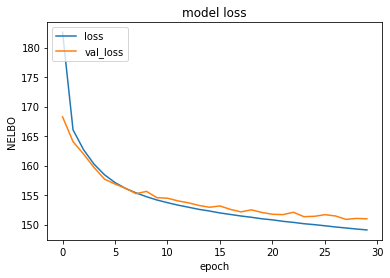
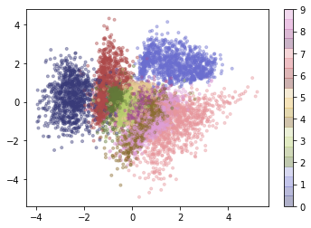
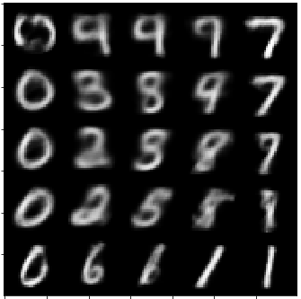

# Variational Autoencoder

VAE with Gaussian Latent Variables and Gaussian Posterior distribution.

### The approximation of deep latent variable models
A deep latent variable model is a latent variable model p(**x**, **z**) whose distributions are parametrized by neural networks. In these models, the posterior p(**z**|**x**) is intractable, so we need to approximate the inference. By introducing a suitable parametric inference model q_phi(**z**|**x**), parametrized by variational parameters, we turn inference and learning into a tractable problem. In physics, this approximation sheme is called mean field approximation.

### References
+ [An Introduction to Variational Autoencoders](https://arxiv.org/pdf/1906.02691.pdf)
+ [A high-bias, low-variance introduction to Machine Learning for physicists](https://arxiv.org/abs/1803.08823)
+ [A Tutorial on Variational Autoencoders with a Concise Keras Implementation](https://tiao.io/post/tutorial-on-variational-autoencoders-with-a-concise-keras-implementation/)

### Plots
##### Loss (NELBO)

##### MNIST test set embedding in 2-dim space spanned by the latent variable layer

##### Generated samples
